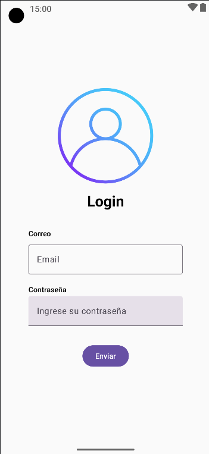

# Calculadora

# Lab #2: Pantalla de Inicio de Sesión con Calculadora

Este proyecto es una aplicación Android desarrollada en Kotlin que combina una funcionalidad básica de autenticación con una calculadora integrada. A continuación, se detallan las características principales:

## Funcionalidades

### 1. Pantalla de Inicio de Sesión

* Solicita al usuario un nombre de usuario y una contraseña.
* Solo se permite el acceso con una combinación específica de usuario y contraseña válida.
* En caso de credenciales incorrectas, se muestra un mensaje de error claro.
* Una vez autenticado, el usuario es redirigido a la pantalla de la calculadora.

### 2. Pantalla de Calculadora

* Incluye una calculadora funcional con operaciones básicas:

  * Suma
  * Resta
  * Multiplicación
  * División
* Diseño intuitivo y amigable para el usuario.
* Botón "Salir" que permite cerrar la sesión y volver a la pantalla de inicio.

## Tecnologías Usadas

* **Lenguaje:** Kotlin
* **IDE:** Android Studio

## Instrucciones de Uso

1. Clona este repositorio en tu máquina local:

   ```bash
   git clone <https://github.com/EdMasterdev/Calculadora>  
   ```
2. Abre el proyecto en Android Studio.
3. Ejecuta la aplicación en un emulador o dispositivo físico.
4. Ingresa las credenciales correctas para acceder a la calculadora.

## Capturas de Pantalla

### Pantalla de Inicio de Sesión



### Pantalla de calculadora


